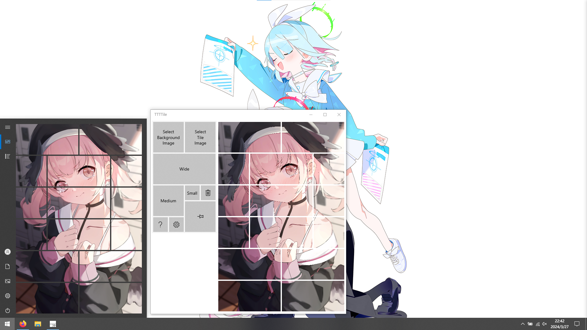

# TTTTile

- [English](./README.md)
- [简体中文](./docs/README.zh_cn.md)

---

A better tool for image tile.

- Image：[コハル By 椿A](https://www.pixiv.net/artworks/116812013)
- Wallpapper：[arona / prana By bmtol](https://www.pixiv.net/artworks/109681008)

## How To Use

- Left click to move the tile.
- Right click to move the image.
- Middle click to remove the tile.
- Scroll wheel to zoom the picture.
