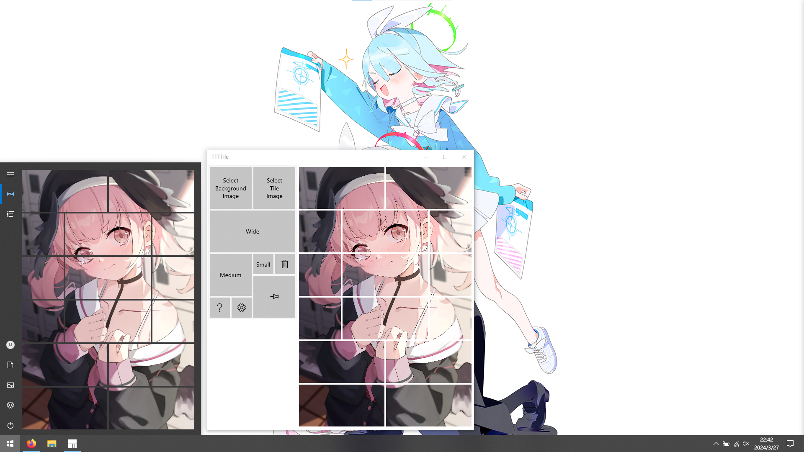

# TTTTile

- [English](../README.md)
- [简体中文](./README.zh_cn.md)

---

更自由的图片磁贴工具

- 图片：[コハル By 椿A](https://www.pixiv.net/artworks/116812013)
- 桌面：[arona / prana By bmtol](https://www.pixiv.net/artworks/109681008)

## 如何安装

首先，请在开发者选项中允许 `从任意源(包括松散文件)安装应用`

以管理员身份运行 PowerShell，在其中输入 `Set-ExecutionPolicy RemoteSigned`，以允许运行未签名的本地脚本
> 之后你可以通过运行 `Set-ExecutionPolicy Restricted` 恢复默认设置

安装方法：
1. 从 [Release](https://github.com/HuaiminNotSleepYet/TTTTile/releases) 页面下载对应平台的安装包
2. 进入解压后的文件夹，找到 `Install.ps1` 文件，右键点击 `使用 PowerShell运行`
3. 初次运行时，会要求管理员权限，请按 `回车` 继续
4. 安装证书时，输入 `Y` 并回车以继续
5. 进度条读完后，应用安装完成

## 使用方法

- 左键拖动磁贴
- 右键拖动图片
- 中键删除磁贴
- 滚轮缩放图片
